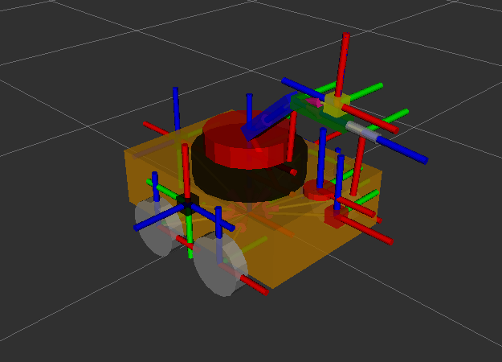
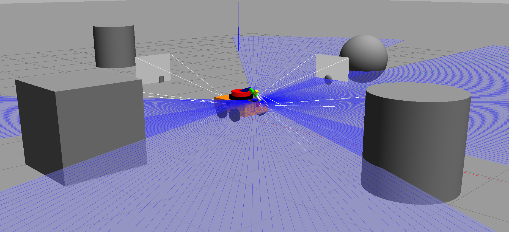

# 🚒 Water-Turret-AGV ROS2 Package

Welcome to the **Water-Turret-AGV** ROS2 package!  
This repository provides everything needed to simulate a differential drive mobile robot equipped with a water turret. The robot is described using both **URDF (for RViz)** and **XACRO (for Gazebo)**, and can be controlled via keyboard teleoperation.

## 🎥 RViz View



## 🎥 Gazebo View



## 🎥 Gazebo Simulation Demo


---

## 📚 Table of Contents

- [Introduction](#introduction)
- [Prerequisites](#prerequisites)
- [Setting Up Your ROS2 Workspace](#setting-up-your-ros2-workspace)
  - [1. Create a ROS2 Workspace](#1-create-a-ros2-workspace)
  - [2. Create the `my_ddrobot` Package](#2-create-the-my_ddrobot-package)
  - [3. Organize Your Files](#3-organize-your-files)
- [Running the Simulations](#running-the-simulations)
  - [1. Displaying URDF in RViz](#1-displaying-urdf-in-rviz)
  - [2. Simulating XACRO in Gazebo](#2-simulating-xacro-in-gazebo)
  - [3. Standard Teleop Key for Mobile Robot](#3-standard-teleop-key-for-mobile-robot)
- [Project Structure](#project-structure)
- [Contributing](#contributing)
- [License](#license)

---

## Introduction

This ROS2 package demonstrates a simulation of a mobile AGV robot equipped with a water turret. It includes:

- 🛠️ **URDF in RViz**  
- 🧩 **XACRO in Gazebo**
- 🎮 **Teleoperation support** for both mobile base and turret

---

## ✅ Prerequisites

Ensure you have **ROS2 Humble** installed on Ubuntu.

Then install the required packages:

```bash
sudo apt update
sudo apt install \
  ros-humble-joint-state-publisher-gui \
  ros-humble-robot-state-publisher \
  ros-humble-xacro \
  ros-humble-gazebo-ros-pkgs \
  ros-humble-teleop-twist-keyboard
```

---

## 🛠️ Setting Up Your ROS2 Workspace

### 1. Create a ROS2 Workspace

```bash
mkdir -p ~/ws_my_robot/src
cd ~/ws_my_robot
colcon build
source install/setup.bash
```

### 2. Create the `my_ddrobot` Package

```bash
cd ~/ws_my_robot/src
ros2 pkg create --build-type ament_python my_ddrobot
```

### 3. Organize Your Files

```bash
cd ~/ws_my_robot/src
git clone https://github.com/mohanchandrass/Water-Turret-AGV.git
mv Water-Turret-AGV/my_ddrobot/* my_ddrobot/
rm -rf Water-Turret-AGV  # optional
```

---

## 🚀 Running the Simulations

⚠️ Remember to **source your workspace** in every new terminal:

```bash
source ~/ws_my_robot/install/setup.bash
```

---

### 1. Displaying URDF in RViz

Launch command:

```bash
ros2 launch urdf_tutorial display.launch.py model:=/home/YOUR_USERNAME/ws_my_robot/src/my_ddrobot/model/my_robot.urdf
```

Expected Output:

- Your robot should appear in **RViz**.
- Sliders for joint state manipulation via GUI.

📷 Example:


---

### 2. Simulating XACRO in Gazebo

Steps:

```bash
cd ~/ws_my_robot
colcon build
source install/setup.bash
export LIBGL_ALWAYS_SOFTWARE=1
ros2 launch my_ddrobot dd_robot.launch.py
```

Expected Output:

- Gazebo launches with your robot spawned and active.

📷 Example:


---

### 3. Standard Teleop Key for Mobile Robot

#### Control the Mobile Base:

```bash
ros2 run teleop_twist_keyboard teleop_twist_keyboard
```

#### Control the Water Turret:

```bash
python3 ~/ws_my_robot/src/my_ddrobot/scripts/arm_turret_teleop.py
```

> 🛠️ Ensure script permissions:
```bash
chmod +x ~/ws_my_robot/src/my_ddrobot/scripts/arm_turret_teleop.py
```

📷 Example:


---

## 🧾 Project Structure

```
Water-Turret-AGV/
├── my_ddrobot/
│   ├── launch/
│   │   └── dd_robot.launch.py
│   ├── model/
│   │   ├── my_robot.urdf
│   │   └── my_robot.xacro
│   ├── scripts/
│   │   └── arm_turret_teleop.py
│   ├── package.xml
│   └── setup.py
└── images/
    ├── rviz_urdf_display.png
    ├── gazebo_xacro_simulation.png
    └── teleop_control.gif
```

---

## 🤝 Contributing

Contributions are welcome!  
Open an issue or a pull request if you find bugs, want to improve this project, or need new features.

---

## 📄 License

[MIT License](LICENSE) 
